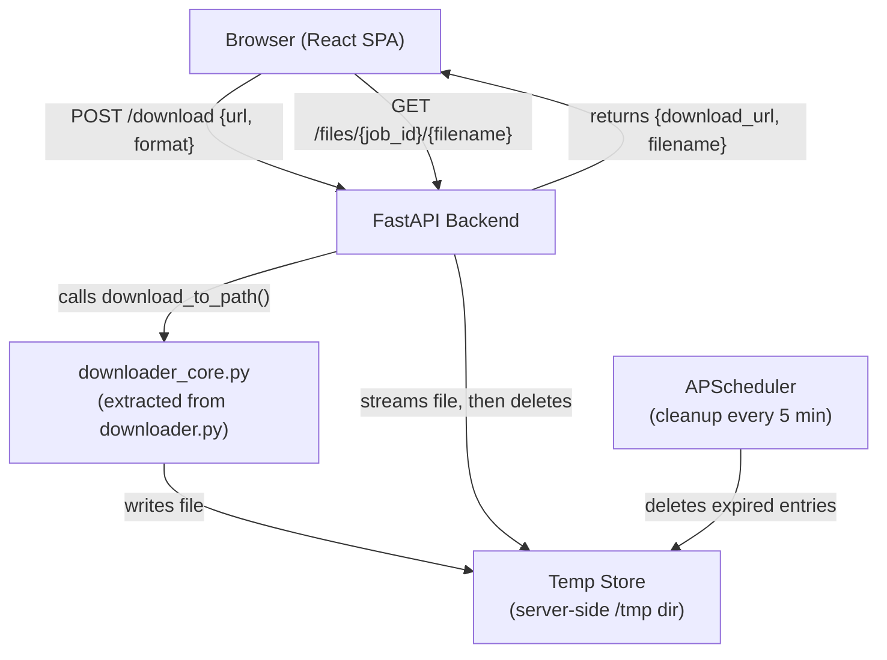

# Design Document: Web UI

## Overview

The Web UI feature wraps the existing CLI downloader in a browser-based interface. A React + Vite single-page application (SPA) lets users paste a URL, pick a format, and click Download. A FastAPI backend receives the request, delegates to the existing `downloader.py` logic, stores the output file in a server-side temp directory, and returns a one-time download link. The file is deleted either when the user retrieves it or after one hour, whichever comes first.

Key constraints:
- No auth, no database, no user accounts
- Plain CSS (no Tailwind, no component libraries)
- Reuses `downloader.py` helpers — no duplication of yt-dlp option construction
- Frontend lives at `web/frontend/`, backend at `web/backend/`

---

## Architecture



**Request lifecycle:**

1. User submits URL + format from the browser.
2. Frontend validates the URL is non-empty, then POSTs to `/download`.
3. Backend validates the request body (Pydantic), generates a UUID job ID, creates a temp subdirectory, and calls `download_to_path()`.
4. On success, backend records the job in an in-memory store and returns `{ download_url, filename }`.
5. User clicks the link; browser GETs `/files/{job_id}/{filename}`.
6. Backend streams the file as an attachment, then deletes the file and removes the job record.
7. A background scheduler runs every 5 minutes and removes any job whose file is older than 1 hour.

**CORS:** During local development the frontend runs on `http://localhost:5173` (Vite default) and the backend on `http://localhost:8000`. FastAPI's `CORSMiddleware` is configured to allow `http://localhost:5173` in development. In production both are served from the same origin, so CORS is not needed.

---

## Project Structure

```
web/
├── README.md                        # Setup and run instructions for both services
├── frontend/                        # React + Vite SPA
│   ├── index.html
│   ├── package.json                 # Vitest, fast-check, React Testing Library
│   ├── vite.config.js
│   └── src/
│       ├── main.jsx
│       ├── App.jsx                  # Root component, owns all state
│       ├── api.js                   # fetch wrapper for backend calls
│       ├── components/
│       │   ├── DownloadForm.jsx     # URL input + format selector + submit button
│       │   ├── UrlInput.jsx
│       │   ├── FormatSelector.jsx
│       │   ├── SubmitButton.jsx
│       │   ├── StatusDisplay.jsx    # Switches between spinner / link / error
│       │   ├── LoadingSpinner.jsx
│       │   ├── DownloadLink.jsx
│       │   └── ErrorMessage.jsx
│       ├── styles/
│       │   └── main.css             # Plain CSS, no framework
│       └── __tests__/
│           ├── App.test.jsx
│           ├── DownloadForm.test.jsx
│           └── DownloadLink.test.jsx
└── backend/                         # FastAPI application
    ├── requirements.txt             # fastapi, uvicorn, apscheduler, yt-dlp, hypothesis
    ├── main.py                      # FastAPI app, routes, CORS, lifecycle hooks
    ├── downloader_core.py           # download_to_path() — extracted from downloader.py
    ├── temp_store.py                # TempStore + JobRecord
    ├── scheduler.py                 # APScheduler wrapper + cleanup_expired_jobs()
    └── tests/
        ├── test_downloader_core.py
        ├── test_temp_store.py
        └── test_routes.py
```

`downloader.py` at the project root is **not modified**. `downloader_core.py` is a new file that extracts the headless-safe logic. The existing `download()` function in `downloader.py` can optionally delegate to `downloader_core.py` in a follow-up refactor, but that is out of scope here.

---

## Components and Interfaces

### Backend

#### `web/backend/downloader_core.py`

Extracted from `downloader.py`. Provides a single public function that the backend calls:

```python
def download_to_path(url: str, fmt: str, output_dir: str) -> str:
    """
    Download media from `url` in format `fmt` ('video' or 'audio')
    into `output_dir`. Returns the absolute path of the downloaded file.
    Raises DownloadError on failure. Does NOT call sys.exit().
    """
```

Internally it reuses `validate_url`, `validate_format`, and the yt-dlp option construction from `downloader.py`. The `outtmpl` is set to `output_dir/%(title)s.%(ext)s` instead of the hardcoded `downloads/` path. The function raises `yt_dlp.utils.DownloadError` on failure rather than calling `sys.exit(1)`.

#### `web/backend/main.py`

FastAPI application entry point. Registers routes, middleware, and the startup/shutdown lifecycle for the scheduler.

**Routes:**

| Method | Path | Description |
|--------|------|-------------|
| `POST` | `/download` | Accept `{url, format}`, run download, return `{download_url, filename}` |
| `GET` | `/files/{job_id}/{filename}` | Stream the file as an attachment, then delete it |

**Middleware:**
- `CORSMiddleware` — allows `http://localhost:5173` (configurable via `ALLOWED_ORIGINS` env var)

#### `web/backend/temp_store.py`

In-memory job registry. Thread-safe via a `threading.Lock` (APScheduler runs in a background thread).

```python
@dataclass
class JobRecord:
    job_id: str
    file_path: str        # absolute path on disk
    filename: str         # original filename for Content-Disposition
    created_at: datetime  # UTC, used for expiry check

class TempStore:
    def add(self, record: JobRecord) -> None: ...
    def get(self, job_id: str) -> JobRecord | None: ...
    def remove(self, job_id: str) -> None: ...
    def expired_jobs(self, max_age_seconds: int = 3600) -> list[JobRecord]: ...
```

The temp directory root is configurable via the `TEMP_DIR` environment variable; defaults to `tempfile.mkdtemp()` at startup. Each job gets its own subdirectory: `{TEMP_DIR}/{job_id}/`.

#### `web/backend/scheduler.py`

Wraps APScheduler. Runs `cleanup_expired_jobs()` every 5 minutes.

```python
def cleanup_expired_jobs(store: TempStore) -> None:
    """Delete files and records for all expired jobs."""
    for record in store.expired_jobs():
        try:
            shutil.rmtree(Path(record.file_path).parent, ignore_errors=True)
        finally:
            store.remove(record.job_id)
```

### Frontend

#### Component tree

```
App
├── DownloadForm
│   ├── UrlInput
│   ├── FormatSelector
│   └── SubmitButton
├── StatusDisplay
│   ├── LoadingSpinner   (shown while request is in-flight)
│   ├── DownloadLink     (shown on success)
│   └── ErrorMessage     (shown on error)
└── (future: HistoryList — out of scope)
```

#### `App.jsx`

Owns all state. Passes handlers down as props.

```js
const [url, setUrl]           = useState('')
const [format, setFormat]     = useState('video')
const [status, setStatus]     = useState('idle') // 'idle' | 'loading' | 'success' | 'error'
const [result, setResult]     = useState(null)   // { download_url, filename }
const [errorMsg, setErrorMsg] = useState('')
const [urlError, setUrlError] = useState('')     // inline validation
```

#### `DownloadForm.jsx`

Handles the submit event. Validates URL client-side before calling the API. Disables the submit button while `status === 'loading'`.

#### `api.js`

Single module for all backend calls. Keeps fetch logic out of components.

```js
export async function requestDownload(url, format) {
  const res = await fetch('http://localhost:8000/download', {
    method: 'POST',
    headers: { 'Content-Type': 'application/json' },
    body: JSON.stringify({ url, format }),
  })
  if (!res.ok) {
    const err = await res.json()
    throw new Error(err.detail ?? 'Download failed')
  }
  return res.json() // { download_url, filename }
}
```

The base URL is read from `import.meta.env.VITE_API_BASE_URL` (defaults to `http://localhost:8000`), making it easy to point at a deployed backend.

#### `DownloadLink.jsx`

Renders an `<a href={download_url} download={filename}>` tag. The `download` attribute triggers a browser save-as dialog. Displays the filename next to the link.

---

## Data Models

### Backend — Pydantic request/response models

```python
# Request body for POST /download
class DownloadRequest(BaseModel):
    url: str = Field(..., min_length=1, description="Media URL to download")
    format: Literal["video", "audio"] = Field("video", description="Output format")

# Success response from POST /download
class DownloadResponse(BaseModel):
    download_url: str   # e.g. "/files/{job_id}/{filename}"
    filename: str       # e.g. "My Video Title.mp4"

# Error response (used for 422, 500)
class ErrorResponse(BaseModel):
    detail: str
```

Pydantic automatically returns `422 Unprocessable Entity` with a structured body when `DownloadRequest` validation fails (empty URL, invalid format). The backend adds an explicit `500` handler for `DownloadError`.

### In-memory job store

```python
@dataclass
class JobRecord:
    job_id: str          # UUID4 string
    file_path: str       # absolute path to the downloaded file
    filename: str        # basename, used in Content-Disposition header
    created_at: datetime # UTC timestamp, set at job creation
```

No persistence — the store is reset on server restart. Any files left in the temp directory from a previous run are cleaned up at startup.

### Frontend state shape

```ts
// Conceptual TypeScript shape (project uses plain JS)
type Status = 'idle' | 'loading' | 'success' | 'error'

interface AppState {
  url: string
  format: 'video' | 'audio'
  status: Status
  result: { download_url: string; filename: string } | null
  errorMsg: string
  urlError: string
}
```

---

## Correctness Properties

*A property is a characteristic or behavior that should hold true across all valid executions of a system — essentially, a formal statement about what the system should do. Properties serve as the bridge between human-readable specifications and machine-verifiable correctness guarantees.*


### Property 1: Whitespace URLs are rejected client-side

*For any* string composed entirely of whitespace characters, submitting it as a URL in the download form SHALL set an inline validation error and SHALL NOT invoke the backend API.

**Validates: Requirements 1.2**

---

### Property 2: Non-empty URLs are forwarded to the backend

*For any* non-empty, non-whitespace-only string submitted as a URL, the frontend SHALL call the backend API with that exact URL value.

**Validates: Requirements 1.3**

---

### Property 3: Selected format is included in every request

*For any* format value (`"video"` or `"audio"`) selected before submission, the frontend SHALL include that format value in the API request body.

**Validates: Requirements 2.4**

---

### Property 4: Loading state is shown for any valid submission

*For any* valid (non-empty) URL submitted via the download form, the frontend SHALL transition to `status = 'loading'` and disable the submit button while the request is in-flight.

**Validates: Requirements 3.2, 3.3**

---

### Property 5: Success response always produces a result state

*For any* `{ download_url, filename }` response returned by the backend, the frontend SHALL transition to `status = 'success'` and store the result so the download link is displayed.

**Validates: Requirements 3.4, 8.1, 8.2**

---

### Property 6: Error response always produces an error state

*For any* error message returned by the backend, the frontend SHALL transition to `status = 'error'` and display that error message to the user.

**Validates: Requirements 3.5**

---

### Property 7: Valid download requests always call the core and return the correct response shape

*For any* valid `(url, format)` pair sent to `POST /download`, the backend SHALL invoke `download_to_path()` with those values, add a `JobRecord` to the temp store, and return a JSON body containing both `download_url` and `filename` fields.

**Validates: Requirements 4.2, 4.3**

---

### Property 8: Invalid format values always return 422

*For any* string that is not `"video"` or `"audio"` submitted as the `format` field, the backend SHALL return HTTP 422.

**Validates: Requirements 4.5**

---

### Property 9: File serving always sets Content-Disposition: attachment

*For any* file stored in the temp store, a GET request to its Temp_Link SHALL return the file with a `Content-Disposition: attachment` header.

**Validates: Requirements 5.2**

---

### Property 10: Missing job IDs always return 404

*For any* job ID that does not exist in the temp store, a GET request to `/files/{job_id}/{filename}` SHALL return HTTP 404.

**Validates: Requirements 5.3**

---

### Property 11: Served files are always deleted after retrieval

*For any* file successfully served via its Temp_Link, the file SHALL be deleted from disk and its `JobRecord` SHALL be removed from the temp store after the response is sent.

**Validates: Requirements 5.4**

---

### Property 12: Cleanup deletes exactly the expired jobs

*For any* set of `JobRecord` entries where some have `created_at` older than 1 hour and some do not, running the cleanup function SHALL delete all files and records for expired jobs and SHALL leave all non-expired jobs and their files untouched.

**Validates: Requirements 6.2, 6.3**

---

### Property 13: Format determines output file extension

*For any* URL, calling `download_to_path(url, "video", ...)` SHALL produce a file with a `.mp4` extension, and calling `download_to_path(url, "audio", ...)` SHALL produce a file with a `.mp3` extension.

**Validates: Requirements 7.2, 7.3**

---

### Property 14: Download link renders all required information

*For any* `{ download_url, filename }` result, the rendered `DownloadLink` component SHALL contain an `<a>` element with `href` equal to `download_url`, a `download` attribute equal to `filename`, and visible text containing `filename`.

**Validates: Requirements 8.1, 8.2, 8.3**

---

## Error Handling

### Backend

| Scenario | HTTP Status | Response body |
|----------|-------------|---------------|
| Empty or missing `url` | 422 | Pydantic validation error detail |
| `format` not `"video"` or `"audio"` | 422 | Pydantic validation error detail |
| `yt_dlp.utils.DownloadError` raised by core | 500 | `{ "detail": "<error message>" }` |
| Job ID not found in temp store | 404 | `{ "detail": "File not found" }` |
| Unexpected exception | 500 | `{ "detail": "Internal server error" }` |

The backend uses a FastAPI exception handler for `DownloadError`:

```python
@app.exception_handler(DownloadError)
async def download_error_handler(request, exc):
    return JSONResponse(status_code=500, content={"detail": str(exc)})
```

Temp directory creation failures at startup are fatal and will prevent the server from starting (intentional — no temp dir means no downloads can work).

### Frontend

| Scenario | UI behaviour |
|----------|-------------|
| Empty URL on submit | Inline error below the input field; no API call |
| Network error (fetch throws) | `errorMsg` set to "Network error — is the server running?" |
| Backend 422 | `errorMsg` set to the `detail` field from the response |
| Backend 500 | `errorMsg` set to the `detail` field from the response |
| Any other non-OK status | `errorMsg` set to "Unexpected error (HTTP {status})" |

The loading indicator and submit button are always re-enabled when the request settles (success or error), preventing the UI from getting stuck.

---

## Testing Strategy

### Backend (Python)

**Framework:** pytest + Hypothesis (already in `requirements.txt`) + FastAPI `TestClient`

**Unit tests** (`web/backend/tests/`):
- `test_downloader_core.py` — tests for `download_to_path()` with mocked yt-dlp
- `test_temp_store.py` — tests for `TempStore` CRUD and `expired_jobs()` logic
- `test_routes.py` — tests for FastAPI routes using `TestClient` with mocked core

**Property-based tests** (Hypothesis, minimum 100 iterations each):

Each property test is tagged with a comment in the format:
`# Feature: web-ui, Property {N}: {property_text}`

| Property | Test file | Hypothesis strategy |
|----------|-----------|---------------------|
| P8: Invalid format → 422 | `test_routes.py` | `st.text().filter(lambda s: s not in ("video", "audio"))` |
| P9: File serving → attachment header | `test_routes.py` | `st.binary()` for file content |
| P10: Missing job ID → 404 | `test_routes.py` | `st.uuids()` |
| P11: Served files deleted after retrieval | `test_routes.py` | `st.binary()` for file content |
| P12: Cleanup deletes exactly expired jobs | `test_temp_store.py` | `st.lists(st.timedeltas(...))` for ages |
| P13: Format determines output extension | `test_downloader_core.py` | `st.sampled_from(["video", "audio"])` with mocked yt-dlp |

**Integration tests** (smoke, single examples):
- Server starts and responds to health check
- `POST /download` with a real yt-dlp call (skipped in CI unless `RUN_INTEGRATION=1`)

### Frontend (JavaScript)

**Framework:** Vitest + React Testing Library

**Unit/example tests** (`web/frontend/src/__tests__/`):
- Format defaults to `"video"` on load
- Selecting a format updates the visual state
- Submit button is disabled while loading
- Backend 500 error displays the error message

**Property-based tests** (fast-check, minimum 100 iterations each):

Each property test is tagged:
`// Feature: web-ui, Property {N}: {property_text}`

| Property | Test file | fast-check arbitrary |
|----------|-----------|----------------------|
| P1: Whitespace URLs rejected | `DownloadForm.test.jsx` | `fc.stringOf(fc.constantFrom(' ', '\t', '\n'))` |
| P2: Non-empty URLs forwarded | `DownloadForm.test.jsx` | `fc.string({ minLength: 1 }).filter(s => s.trim() !== '')` |
| P3: Format included in request | `DownloadForm.test.jsx` | `fc.constantFrom('video', 'audio')` |
| P4: Loading state on valid submit | `DownloadForm.test.jsx` | `fc.string({ minLength: 1 }).filter(s => s.trim() !== '')` |
| P5: Success response → result state | `App.test.jsx` | `fc.record({ download_url: fc.webUrl(), filename: fc.string() })` |
| P6: Error response → error state | `App.test.jsx` | `fc.string({ minLength: 1 })` for error messages |
| P14: Download link renders all info | `DownloadLink.test.jsx` | `fc.record({ download_url: fc.webUrl(), filename: fc.string({ minLength: 1 }) })` |

**Smoke tests:**
- URL input field is present
- Video and Audio options are present
- Download button is present

### Property test configuration

- Backend (Hypothesis): `@settings(max_examples=100)` on all property tests
- Frontend (fast-check): `fc.assert(fc.property(...), { numRuns: 100 })` on all property tests
